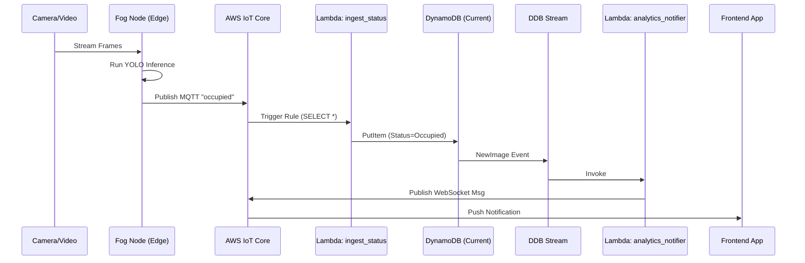
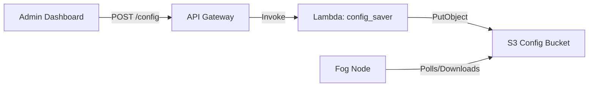
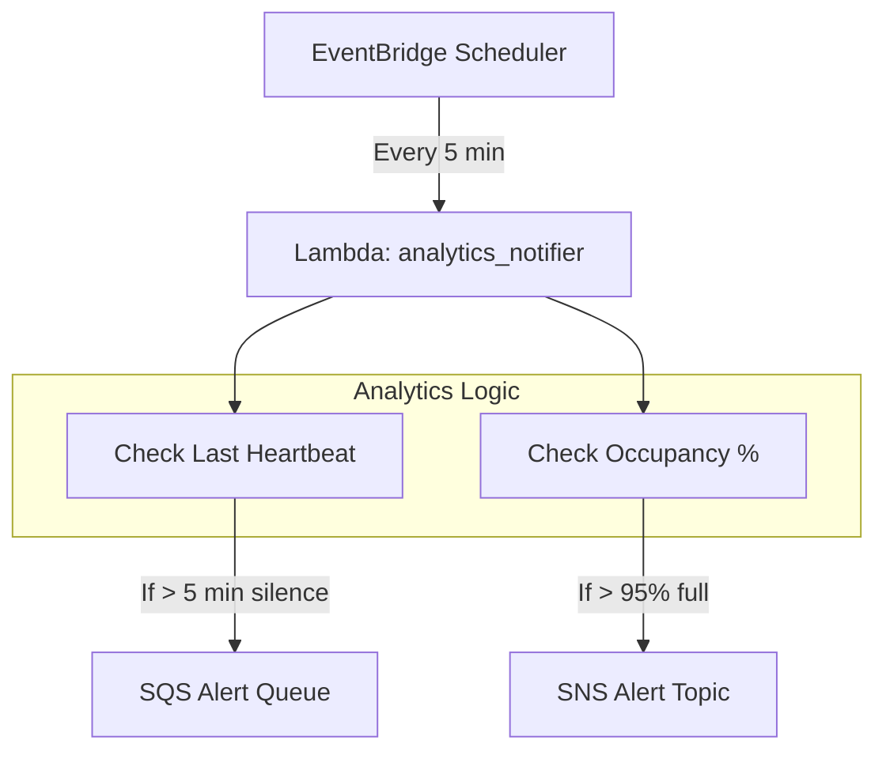

# System Interactions & Dependencies

This document maps the invisible "wiring" between the static components documented elsewhere. It answers questions like "What triggers this?" and "Where does this data go?".

## 1. Deployment Dependencies
How code moves from GitHub to the running environment.

```mermaid
graph TD
    subgraph "CI/CD (GitHub Actions)"
        GH_FOG[Fog Workflow]
        GH_BACKEND[Backend Workflow]
        GH_INFRA[Terraform (Manual)]
    end

    subgraph "AWS Artifacts"
        ECR[Amazon ECR]
        LAMBDA_SVC[AWS Lambda Service]
    end

    subgraph "Runtime Environment"
        EC2[EC2 Camera Hub]
        LAMBDA_FUNC[Running Functions]
    end

    GH_FOG -- Builds Docker Image --> ECR
    EC2 -- Pulls Image --> ECR
    
    GH_BACKEND -- Zips Python Code --> LAMBDA_SVC
    LAMBDA_SVC -- Updates Code --> LAMBDA_FUNC

    GH_INFRA -- Provisions --> ECR
    GH_INFRA -- Provisions --> LAMBDA_FUNC
    GH_INFRA -- Provisions --> EC2
```

### Critical Links
*   **ECR Authorization**: The `EC2 Camera Hub` has an IAM Role (`camera_hub_role`) that grants `ecr:GetAuthorizationToken` and `ecr:BatchGetImage`. Without this, the simulation cannot start.
*   **Lambda Environment**: The `Terraform` code defines the environment variables (e.g., `TABLE_NAME`). The `GitHub Action` *only* updates the code. If you add a new variable in Python, you **must** update Terraform.

---

## 2. Real-Time Data Flow ("The Hot Path")
How a car parking triggers a green light on a user's phone.



### Critical Links
*   **IoT Rule permission**: The `ingest_status` Lambda resource policy must explicitly allow `iot.amazonaws.com` to invoke it.
*   **DynamoDB Stream**: Use `NEW_AND_OLD_IMAGES`. The `analytics_notifier` relies on comparing `OldImage` vs `NewImage` to detect changes (e.g., only alert if status changed from Vacant -> Occupied).

---

## 3. Control Plane (Configuration)
How an Admin updates the parking spots remotely.



### Critical Links
*   **S3 Permissions**: The `Fog Node` (running on EC2 or physical device) needs `s3:GetObject` permission on the specific Config Bucket.
*   **Reload Command**: After uploading to S3, the backend often sends an MQTT command to the device to force an immediate reload, rather than waiting for the next poll.

---

## 4. Alerting & Health Checks
How the system detects failures.



### Critical Links
*   **LWT (Last Will and Testament)**: The `Fog Node` registers an LWT message with IoT Core upon connection. If the device loses power (no graceful disconnect), IoT Core *automatically* publishes this message to the `status` topic, triggering `ingest_status` to mark the device as "Offline".
*   **Scheduled Events**: The `EventBridge` rule targets the `analytics_notifier` Lambda. The Lambda handler must distinguish between a `DynamoDB` event and a `Scheduled` event by checking `event.get("source")`.
