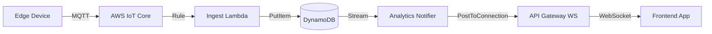

## ESTO TIENE QUE VER CON LOS WEBSOCKETS UTILIZADOS EN EL FRONTEND

# Real-time Updates & WebSocket Architecture

This document explains how TeraSpot achieves real-time updates using AWS API Gateway WebSockets, Lambda, and DynamoDB Streams.

## 🔄 Architecture Overview

The real-time system follows an **Event-Driven Architecture**:



## 🛠️ Components

### 1. API Gateway (WebSocket API)
- **Endpoint:** `wss://vmdq0zxc18.execute-api.us-east-1.amazonaws.com/dev` (Configurable via `EXPO_PUBLIC_WEBSOCKET_URL` environment variable)
- **Routes:**
    - `$connect`: Triggers `ws_connect` Lambda.
    - `$disconnect`: Triggers `ws_disconnect` Lambda.

### 2. Lambda Functions
- **`ws_connect`:**
    - **Trigger:** Client connects to WebSocket.
    - **Action:** Saves `connection_id` to `parking-connections` DynamoDB table.
- **`ws_disconnect`:**
    - **Trigger:** Client disconnects.
    - **Action:** Removes `connection_id` from `parking-connections`.
- **`analytics_notifier`:**
    - **Trigger:** DynamoDB Stream (INSERT/MODIFY on `parking-spaces-dev`).
    - **Action:**
        1. Reads the change event (New Image vs Old Image).
        2. Scans `parking-connections` for active clients.
        3. Broadcasts the update payload via API Gateway.

### 3. DynamoDB Tables
- **`parking-connections`:** Stores active WebSocket connection IDs.
    - Partition Key: `connection_id`
- **`parking-spaces-dev`:** Stores current state of parking spaces.
    - Stream Enabled: `NEW_AND_OLD_IMAGES`

---

## 🌊 The Data Flow

### Step 1: Connection
1. Frontend calls `new WebSocket(url)`.
2. API Gateway invokes `ws_connect`.
3. Connection ID is saved. Frontend receives "Connected".

### Step 2: Event Ingestion
1. Camera detects a car.
2. `ingest_status` Lambda updates `parking-spaces-dev` with `status: occupied`.

### Step 3: Notification
1. DynamoDB Stream triggers `analytics_notifier`.
2. Lambda detects the change (`vacant` -> `occupied`).
3. Lambda constructs a JSON message:
   ```json
   {
     "type": "UPDATE",
     "data": {
       "space_id": "space-1",
       "status": "occupied",
       "timestamp": "..."
     }
   }
   ```
4. Lambda loops through all connection IDs in `parking-connections`.
5. Sends the JSON to each client via `apigatewaymanagementapi.post_to_connection`.

### Step 4: Frontend Update
1. `dashboard.tsx` receives the WebSocket message.
2. `onmessage` handler parses the JSON.
3. React state (`kpiData`) is refreshed or updated directly.

---

## 🐛 Debugging

**Issue: "WebSocket URL not configured"**
- Check `frontend/apps/admin/app/(tabs)/dashboard.tsx` for the `wsUrl` constant.
- Ensure Terraform output `websocket_api_url` matches the code.

**Issue: No updates receiving**
1. Check `parking-connections` table in DynamoDB. Are there items?
2. Check CloudWatch Logs for `analytics_notifier`.
    - Look for "Posting to connection..." logs.
    - Look for `410 Gone` errors (stale connections).

**Issue: Latency is high**
- Check `ingest_status` logs for `processed_timestamp`.
- Ensure `analytics_notifier` isn't throttling (check concurrency limits).


## LO SIGUIENTE TIENE QUE VER CON METRICAS 

# TeraSpot Analytics & Core System Updates

This document details the recent core architectural changes and new analytics features implemented in the TeraSpot platform.

## 🚀 Key Analytics Features (New)

We have implemented a comprehensive 3-Level KPI framework to provide deeper insights into parking operations.

### Level 1: Operational Metrics (Real-time)
*Focus: Immediate status for drivers and operators.*
- **Occupancy Rate:** Real-time percentage of occupied spaces.
- **Vacant Spaces:** Count of available spots, broken down by zone.
- **Critical Capacity:** Automated alerts when occupancy exceeds 95%.

### Level 2: Performance Metrics (System Health)
*Focus: Quality of service and hardware reliability.*
- **Detection Confidence:** Average AI confidence score.
    - *New Feature:* **Low Confidence Rate** tracks the % of detections < 75% confidence to identify dirty lenses or obstructions.
- **System Health:** Tracks active vs. inactive edge devices.
- **Message Latency:** (New) Measures end-to-end time from Edge detection to Cloud storage.
    - *Target:* < 2 seconds.
    - *Implementation:* Added `processed_timestamp` to DynamoDB ingestion.

### Level 3: Business Analytics (Historical)
*Focus: Long-term trends and planning.*
- **Parking Duration:** Average time a vehicle stays in a spot.
    - *Enhancement:* Smart formatting (minutes vs. hours) for short-term parking.
- **Peak Hours:** Identifies busiest times of day.
- **Occupancy Trend:** 24-hour historical view of utilization.

---

## 🛠️ Core Architectural Changes

### 1. Backend (AWS Lambda & DynamoDB)
- **`ingest_status` Lambda:**
    - Updated to record `processed_timestamp` for latency tracking.
    - Implemented logic to handle "Heartbeats" vs "State Changes" differently.
- **`kpi_monitor` Lambda:**
    - Completely refactored to support the 3-Level KPI structure.
    - Added aggregation logic for `message_latency` and `low_confidence_rate`.
- **`analytics_notifier` Lambda:**
    - Now triggers on DynamoDB Streams to broadcast real-time updates via WebSockets.

### 2. Frontend (Admin Dashboard)
- **New Dashboard UI:**
    - Replaced static placeholders with dynamic **KPI Cards**.
    - Added **Occupancy Gauge** and **Trend Charts**.
- **Real-time Integration:**
    - Connected to AWS API Gateway WebSockets for live updates.
    - Implemented `formatDuration` helper for better UX on short parking sessions.
- **Data Handling:**
    - Adjusted time windows (24h lookback) to support sparse data in development environments.

### 3. Edge Computing (Fog)
- **YOLO Integration:**
    - Optimized confidence reporting to support the new "Low Confidence" metric.

---

## 📚 Related Documentation

- **[WebSocket Architecture](docs/WEBSOCKETS.md):** Detailed flow of real-time updates.
- **[API Definition](frontend/packages/core/src/api.ts):** TypeScript interfaces for the new KPI data structures.
